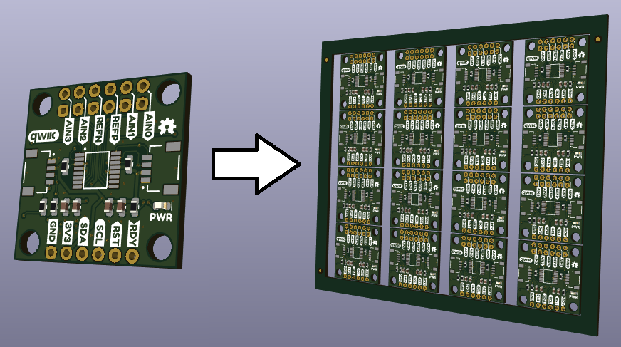
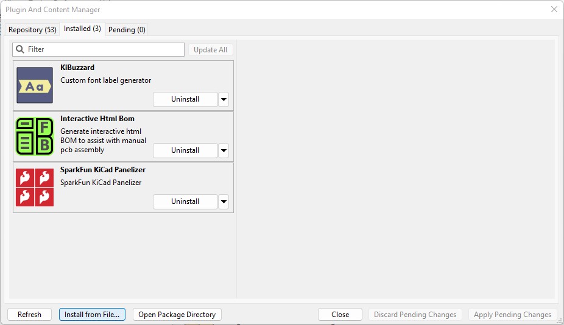
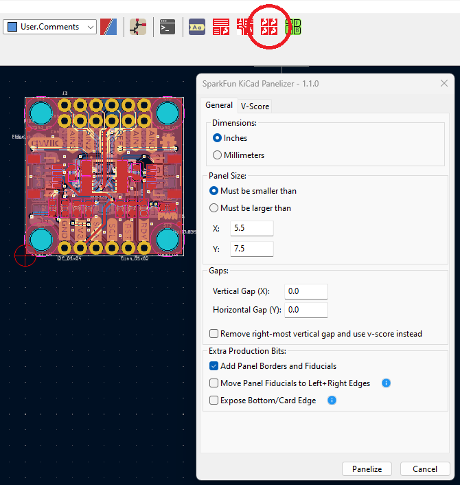
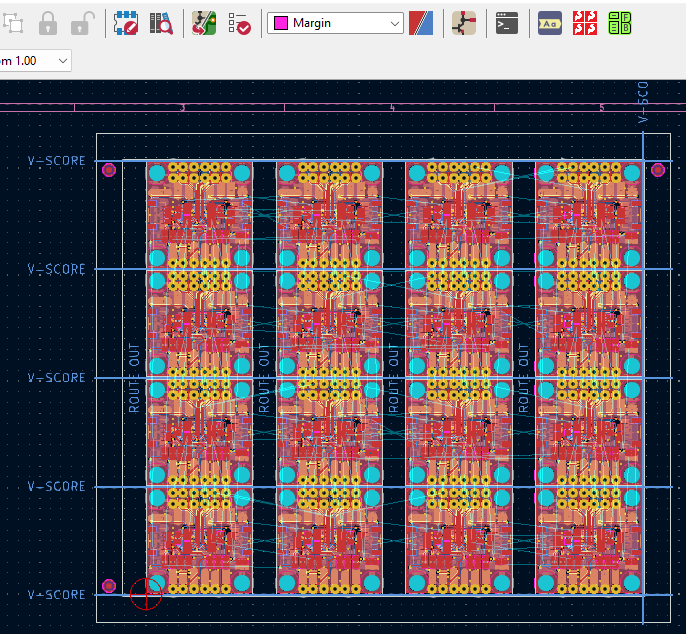

# SparkFun PCB Panelizer plugin for KiCad 7 / 8

This plugin converts a single PCB into a panel of multiple PCBs, separated by v-score grooves.

We've tried to keep this panelizer simple and easy-to-use, while also including all of the features of the original [SparkFun Panelizer for Eagle](https://github.com/sparkfun/SparkFun_Eagle_Settings/blob/main/ulp/SparkFun-Panelizer.ulp). If you need a more comprehensive panelizer which supports tabs, rounded corners, mouse-bites and a whole bunch of other features, please check out [Jan Mrázek (@yaqwsx)](https://github.com/yaqwsx)'s [KiKit](https://github.com/yaqwsx/KiKit).

## Limitations

This is a simple panelizer. Simple to install, simple to use. Simple to write and maintain too. As such, it has limitations...:

* Each copy of the board uses the same net names; if you run the DRC on the panel, it will find multiple unconnected net errors between the copies.
* The part references are duplicated too; you will see multiple R1's, U1's, etc. in the BOM. (Some users actually prefer that!) ([KiKit](https://github.com/yaqwsx/KiKit) avoids this by creating unique copies with unique net names and part IDs.)
* The edge cuts of the original board are copied across into the panel. The v-score grooves define and 'fill' the gap between boards. We've never had a problem having panels manufactured even though, strictly, the individual boards are 'floating' within the panel. (That's how the [SparkFun Panelizer for Eagle](https://github.com/sparkfun/SparkFun_Eagle_Settings/blob/main/ulp/SparkFun-Panelizer.ulp) does it too.)

## Installation and Usage

Open the KiCad Plugin and Content Manager (PCM) from the main window and filter for `SparkFun Panelizer`.

To install manually, open the [GitHub Repo Releases page](https://github.com/sparkfun/SparkFun_KiCad_Panelizer/releases) and download the `SparkFunKiCadPanelizer-pcm.zip` file attached to the latest release. Then use the PCM _**Install from File...**_ option and select the .zip file to install it. For best results, **Uninstall** the previous version first, **Apply Pending Changes**, and then **Install from File...**.

The panelizer plugin runs inside the KiCad PCB Editor window. (Although you can run the panelizer in a Command Prompt too. See [below](#how-it-works) for details.)

Click the four flame panelizer icon to open the panelizer GUI:

We have deliberately kept the GUI options as simple as possible. (More options are available in the Command Prompt).

* Select your units: inches or mm. The panel size and gap settings are defined using these units.
* Set your preferred panel size in X and Y. You can instruct the panelizer to make the panel smaller or larger than the defined size. We usually want the panel to be smaller than 5.5" x 7.5" for our Pick and Place machine. But larger-than is handy if you are creating a panel containing a single PCB. Set the panel size to (e.g.) 1" x 1", and select larger-than.
* You can add vertical or horizontal gaps between columns or rows of boards. This is handy if you have overhanging components - like USB-C connectors.
* If you are designing a M.2 card - like our MicroMod Processor Boards and Function Boards - select the exposed edge option. The panelizer will create a panel with one or two rows of PCBs depending on the panel size. For two-row, the top row is automatically rotated by 180 degrees to expose the PCB 'bottom' edge.
* From v1.1.0, you can use the V-Score page to set the layer for the v-score lines and text. Previously this was hard-coded to `User.Comments`. From v1.1.0, you can select an alternate layer (e.g. `User.1`) if `User.Comments` already has text on it. Select the same layer when running the [CAMmer](https://github.com/sparkfun/SparkFun_KiCad_CAMmer).

Click **Panelize** to panelize the board.

The panel is automatically saved to a sub-folder called `Production` and has "panelized" included in the file name. KiCad will save it as a separate project, with its own separate backups. Remember to re-open your original PCB afterwards.

The panelizer settings are saved in a file called `panel_config.json` so they can be reused.

SparkFun ordering instructions are saved in `ordering_instructions.txt`. These are generated from the logos and text found in the PCB drawing.

`panelizer.log` contains useful diagnostic information. If the PCB fails to panelize, you will find the reason why in `panelizer.log`.

## License and Credits

The code for this plugin is licensed under the MIT license. Please see `LICENSE` for more info.

`panelizer.py` is based heavily on [Simon John (@sej7278)](https://github.com/sej7278/kicad-panelizer)'s version of [Willem Hillier (@willemcvu)'s kicad-panelizer](https://github.com/willemcvu/kicad-panelizer).

The [wxFormBuilder](https://github.com/wxFormBuilder/wxFormBuilder/releases) `text_dialog.fbp` and associated code is based on [Greg Davill (@gregdavill)](https://github.com/gregdavill)'s [KiBuzzard](https://github.com/gregdavill/KiBuzzard).

## How It Works

The plugin GUI itself is designed with [wxFormBuilder](https://github.com/wxFormBuilder/wxFormBuilder/releases) and stored in `text_dialog.fbp`.
Copy and paste the wx Python code from wxFormBuilder into `./SparkFunKiCadPanelizer/dialog/dialog_text_base.py`.

`.github/workflows/build_asset_release.yml` generates the .zip file containing the plugin Python code (`./plugins`), icon (`./resources`) and the Plugin and Content Manager (PCM) `metadata.json`. The workflow automatically attaches the zip file to each release as an asset. Edit `./SparkFunKiCadPanelizer/resource/_version.py` first and update the version number. `build.py` is called by the workflow, copies `metadata_template.json` into `metadata.json` and then updates it with the correct version and download URL. The version number is also added to the .zip filename. The PCM should automatically download and install new versions of the panelizer for you.

You can run the panelizer stand-alone if you want to. Open a **KiCad 7.0 Command Prompt**. On Windows, you will find this in `Start Menu / All Apps / KiCad 7.0`. cd to the `SparkFun_KiCad_Panelizer\SparkFunKiCadPanelizer\panelizer` directory. `python panelizer.py` will show the help for the arguments. When you run the panelizer plugin in KiCad, it will panelize whichever PCB is currently open and save the panel into a copy with the suffix **_panelized.kicad_pcb**. When running the panelizer stand-alone, you need to provide the path `-p` to the PCB to be panelized. But again the panel is saved as a separate copy.

- Your friends at SparkFun

